# 🔵 Clustering: K-Means · Hierarchical · DBSCAN

[](https://colab.research.google.com/github/MMujtabaX/Clustering/blob/main/Clustering_Notebook.ipynb)


> **Unsupervised learning: no labels, just hidden structure in the data.**

A visual, hands-on guide to the three main families of clustering algorithms. It shows how each one works, how to choose its parameters, and where each one succeeds or fails depending on the shape of the data.

<p align="center">
  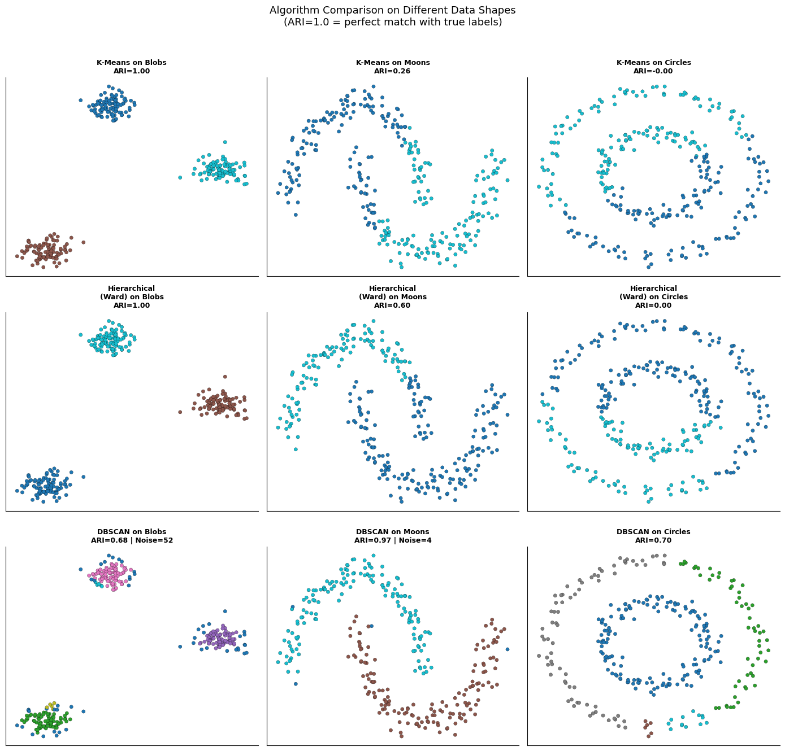
</p>
<p align="center"><sub>All three algorithms on three data shapes. ARI = 1.0 means a perfect match with the true labels.</sub></p>

## 📚 What's Covered

| # | Topic | Key idea |
|---|-------|----------|
| 1 | Why multiple algorithms? | Different data shapes need different approaches |
| 2 | K-Means | Iterative centroid updates; elbow method and silhouette analysis for choosing K |
| 3 | K-Means limitations | Fails on non-spherical shapes like moons and circles |
| 4 | Hierarchical clustering | Dendrograms, cutting the tree, and 4 linkage methods |
| 5 | DBSCAN | Density-based: core, border and noise points |
| 6 | DBSCAN tuning | `eps` × `minPts` sensitivity and the k-distance plot |
| 7 | Head-to-head | All three algorithms on blobs, moons and circles, plus the Iris dataset |

<p align="center">
  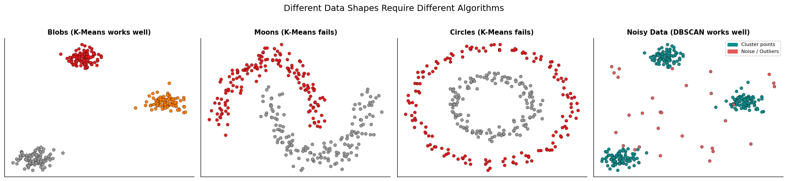
</p>

## 🎯 K-Means

**Objective:** minimize the within-cluster sum of squares (WCSS):

$$\text{WCSS} = \sum_{k=1}^{K} \sum_{x_i \in C_k} \|x_i - \mu_k\|^2$$

<p align="center">
  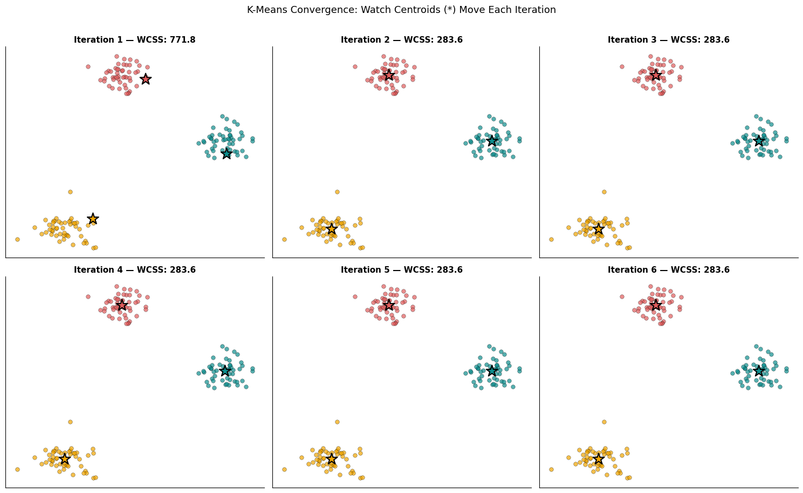
</p>
<p align="center"><sub>Centroids move each iteration until WCSS stops improving.</sub></p>

### Choosing K

Both the **elbow method** and the **silhouette score** correctly identify **K = 4** on data generated with 4 clusters.

<p align="center">
  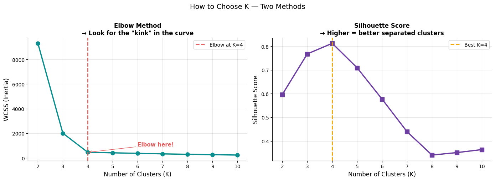
</p>

<p align="center">
  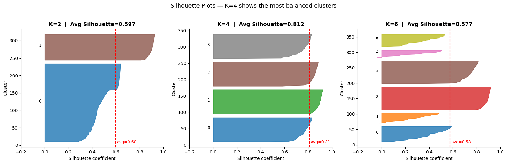
</p>

### Where K-Means fails

K-Means assumes round, convex clusters. On moons and circles it simply cuts the data in half: **ARI 0.25 on moons, 0.00 on circles**.

<p align="center">
  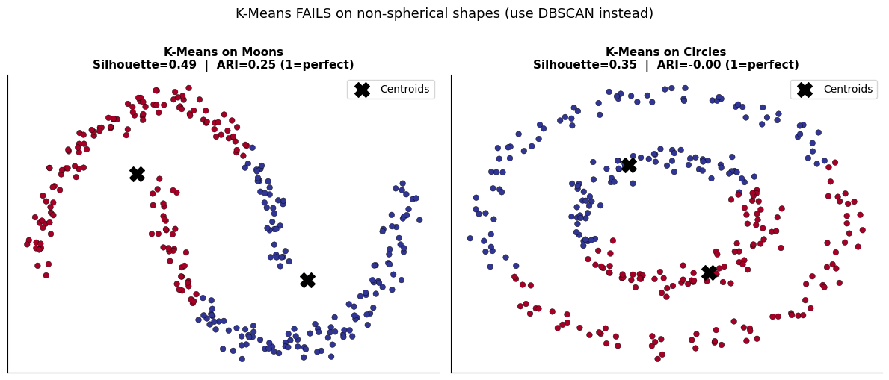
</p>

## 🌲 Hierarchical Clustering

Agglomerative clustering starts with every point as its own cluster and repeatedly merges the two closest ones. Cutting the **dendrogram** at any height gives K clusters, so K doesn't need to be chosen upfront.

<p align="center">
  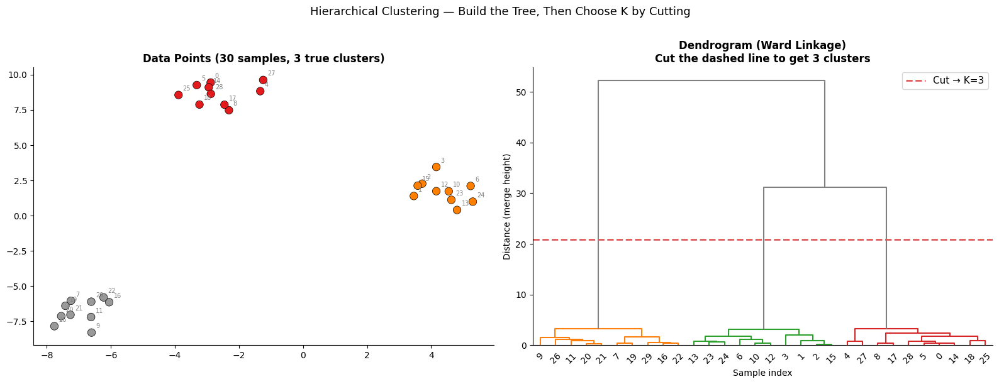
</p>

The **linkage method** defines what "closest" means:

<p align="center">
  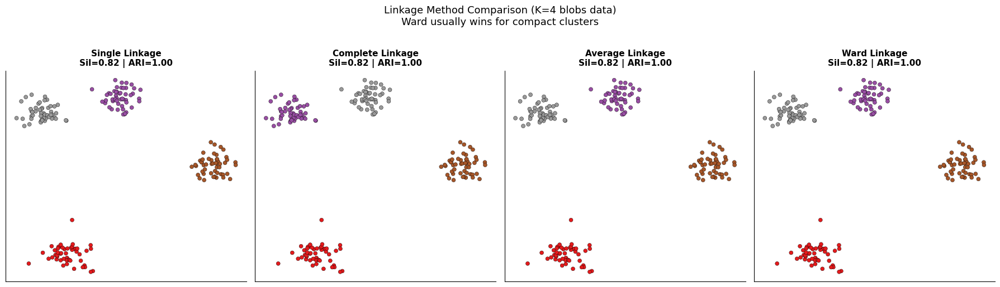
</p>

| Linkage | Distance between clusters | Tendency |
|---------|---------------------------|----------|
| Single | Closest pair of points | Can follow chains and odd shapes; sensitive to noise |
| Complete | Farthest pair of points | Compact clusters |
| Average | Mean of all pairwise distances | A balance of the two |
| Ward | Increase in variance after merging | Compact, even-sized clusters (the usual default) |

## 🌌 DBSCAN

DBSCAN groups points by **density** using two parameters: `eps` (neighborhood radius) and `minPts` (neighbors needed to be a core point). It doesn't need K, finds arbitrary shapes, and labels outliers as **noise**.

<p align="center">
  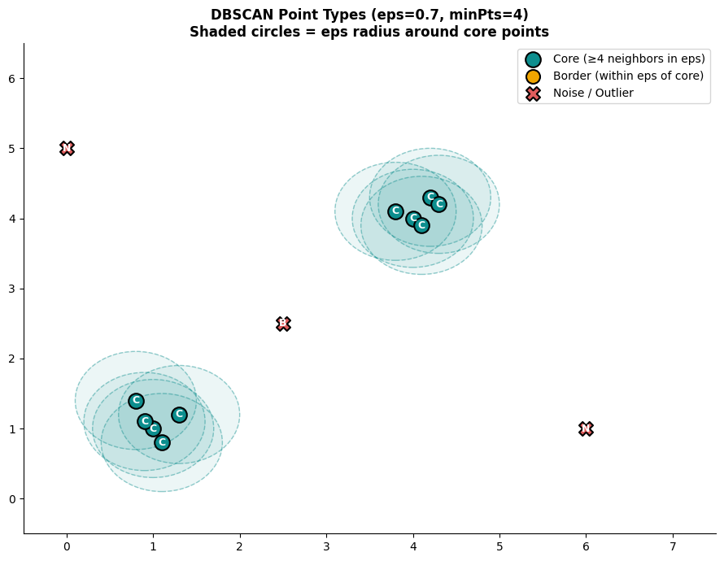
</p>

### DBSCAN is sensitive to its parameters

<table>
  <tr>
    <td>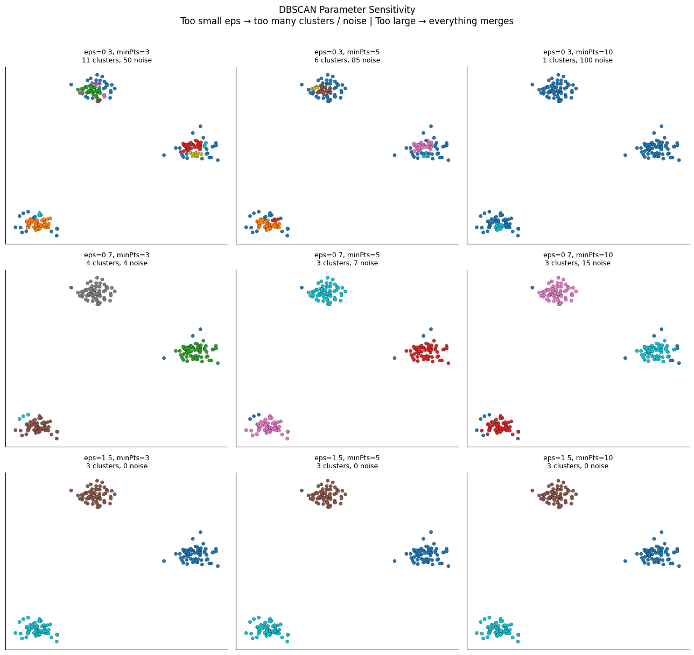</td>
    <td>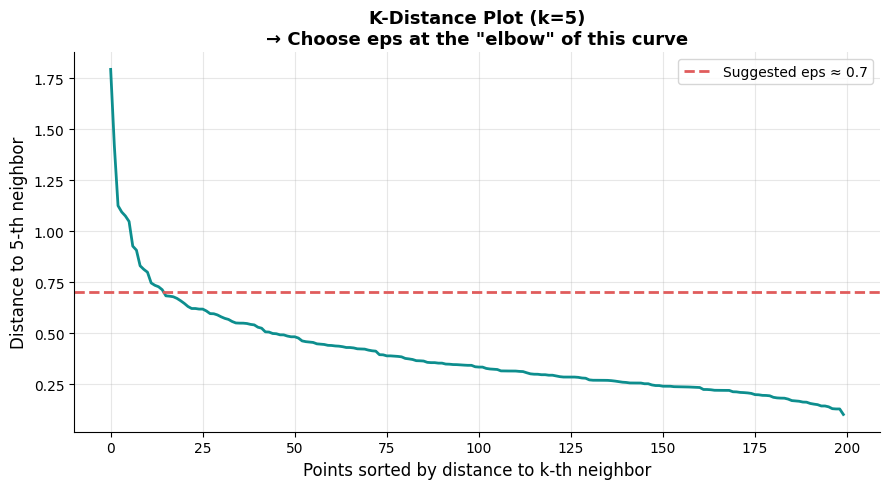</td>
  </tr>
  <tr>
    <td align="center"><b>Too small an <code>eps</code> → many tiny clusters and noise; too large → everything merges</b></td>
    <td align="center"><b>The k-distance "elbow" gives a principled starting value for <code>eps</code></b></td>
  </tr>
</table>

## 📊 Results

### Synthetic shapes (ARI vs true labels)

| Algorithm | Blobs | Moons | Circles |
|-----------|-------|-------|---------|
| K-Means | **1.00** | 0.26 | 0.00 |
| Hierarchical (Ward) | **1.00** | 0.60 | 0.00 |
| DBSCAN | 0.68 | **0.97** | **0.70** |

### Iris dataset (standardized, 150 samples, 3 species)

| Algorithm | Silhouette | ARI | Clusters found | Noise points |
|-----------|------------|-----|----------------|--------------|
| **K-Means (K=3)** | 0.460 | **0.620** | 3 | 0 |
| Hierarchical Ward (K=3) | 0.447 | 0.615 | 3 | 0 |
| DBSCAN (eps=0.5, minPts=5) | 0.656* | 0.442 | 2 | 34 |

\* DBSCAN's silhouette is computed **without its 34 noise points**, and it found only 2 clusters (merging versicolor and virginica). The high silhouette therefore flatters it. ARI, which compares against the true species, shows it performed worst.

## 💡 Key Takeaways

- **No single algorithm wins everywhere.** The right choice depends on the shape of your data.
- **K-Means and Ward** excel on compact, round clusters but can't separate moons or rings.
- **DBSCAN** handles arbitrary shapes and noise, but it is **highly sensitive to `eps`**. With a single `eps` it over-flagged noise on the blobs and split the outer circle into several pieces.
- **Silhouette score can mislead** when an algorithm drops points as noise or finds a different number of clusters. Use more than one metric.
- On real data (Iris), K-Means and hierarchical clustering recovered the species structure best.

| | K-Means | Hierarchical | DBSCAN |
|--|---------|--------------|--------|
| Specify K? | Yes | No (cut the tree) | No |
| Cluster shape | Spherical | Depends on linkage | Arbitrary |
| Handles outliers? | No | Somewhat | Yes |
| Speed | Fast | Slow, O(n²) memory | Moderate |
| Best for | Large data, known K | Exploration, small data | Noisy data, unknown K |

## 🚀 Run It

Click the **Open in Colab** badge above, or run it locally:

```bash
pip install numpy pandas matplotlib seaborn scikit-learn scipy jupyter
jupyter notebook Clustering_Notebook.ipynb
```

## 👤 Author

**Muhammad Mujtaba Khan Suri** — CS @ UBIT, University of Karachi
[GitHub](https://github.com/MMujtabaX)
